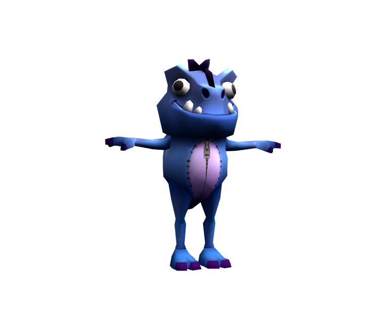
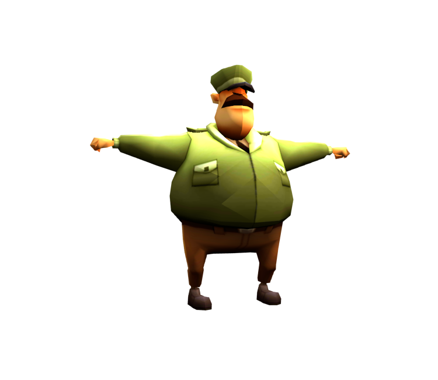
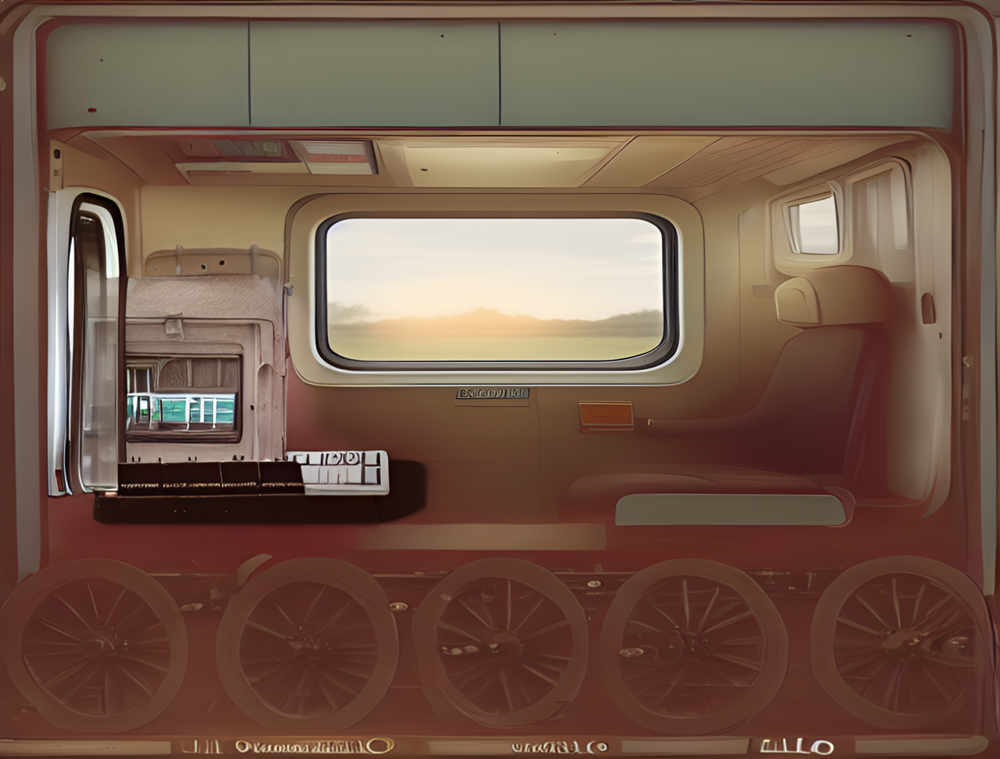

# Projet Colt Express

***

## Table of Contents
- [Résumé du travail effectué](#résumé-du-travail-effectué)
- [Extensions pour enrichir le jeu](#extensions-pour-enrichir-le-jeu)
- [Difficultés rencontrées](#difficultés-rencontrées)
- [Visuals](#visuals)
- [Authors and acknowledgment](#auteures)
- [Project status](#project-status)

## Résumé du travail effectué
Ce projet consiste en une implémentation d'un jeu de programmation appelé "Colt Express". Le jeu se déroule à bord d'un train où les joueurs incarnent des bandits essayant de détrousser les passagers. 
Le projet inclut les éléments suivants :

- Implémentation du modèle de train et de ses composants.
- Implémentation des bandits et de leurs actions (déplacements, braquages, etc.)
- Intégration du Marshall et de ses interactions avec les bandits
- Gestion des butins à bord du train
- Visualisation de jeu
- Gestion des interactions entre les joueurs et des actions de jeu.
- Tests 

Nous avons réalisé un certain nombre de tâches pour travailler sur le projet "Colt Express". Voici un aperçu du travail accompli :

- [x] Complétion du diagramme de classe
  
- [x] Complétion de la hiérarchie des classes
- [x] Gestion des actions des bandits et marshall
- [x] Organisation selon Modèle-Vue-Contrôleur (MVC)
- [x] Amélioration de l'interface graphique
- [x] Conditions de fin de partie 
- [x] Tests

## 2. Choix architecturaux
### Architecture MVC (Modèle-Vue-Contrôleur)
Le projet est organisé sur la base de l'architecture MVC:
- **Modèle**: représente la logique de base du jeu, y compris le train, les bandits et les actions.
- **Vue**: gère les composants de l'interface utilisateur graphique, affichant l'état du jeu et les interactions.
- **Contrôleur**: gère les entrées de l'utilisateur, les traduit en actions et met à jour le modèle et la vue en conséquence.

### Organisation et responsabilités de la classe
- **CModele (Modèle)**
    - Gère l'état du jeu, y compris le train, les bandits, les actions et le Marshall.
    - Fournit des méthodes pour accéder et modifier les éléments du jeu.

- **CVue (Vue)**
    - Représente l'interface graphique pour afficher l'état du jeu et les interactions.
    - Sous-vues pour le train, les joueurs et les boutons d'action (commandes).

- **Controleur**
    - Gère les entrées de l'utilisateur et déclenche les actions correspondantes dans le modèle.
    
## Extensions pour enrichir le jeu
En plus des tâches demandées, nous avons introduit plusieurs extensions pour enrichir l'expérience de jeu :
### Utilisation des raccourcis clavier pour les différentes commandes du jeu.
- **ENTER** pour _Go!_

- **Arrow** pour _Déplacer_

- **SHIFT** + **Arrow** pour _Tirer_

- **B** pour **Braquer**

### Affichage du compte rendu (texts of actions) dans la fenêtre graphique.

### Visuels
Nous tenons à remercier **Subway Surfers** pour leur inspiration, ainsi que pour les dessins de caractères que nous avons utilisés dans notre conception. 
Leur créativité a été une source d'inspiration importante pour notre projet.

Images tirées du site web : https://www.models-resource.com/mobile/subwaysurfers/

Nous voulons aussi remercier **Canva** pour leur fonctionnalité de générateur d'images IA 
qui nous a aidé à obtenir ces magnifiques images de wagons et de locomotives.

### Écran début 

### Écran de sélection de caractères

### Restart button
Nous avons introduit la fonctionnalité de redémarrage qui permet aux joueurs de 
redémarrer le jeu après avoir terminé les tours.

## Difficultés rencontrées
Plusieurs défis ont été rencontrés tout au long du projet :

- Direction des tirs (nous ne savions pas que tirer avait besoin d'une direction auparavant)
**[résolu]**
- Nous pensions que la locomotive n'avait pas de toit et nous avons donc dû la modifier ultérieurement.
**[résolu]**
- Nous avons rencontré quelques problèmes avec nos fichiers tests (Missing TestNG Dependency) **[résolu]**
- La logique de l'ordre dans lequel les actions devaient être performés en appuyant sur le bouton 'GO!' était ambiguë au depart **[résolu]**

### Remerciements
- Keyboard Shortcuts inspiration : https://stackoverflow.com/questions/35283349/how-to-make-enter-key-and-submit-button-have-same-actionevent
- Conway for the MVC implementations

## Auteures
- Lee, Sherlyn Angelina, sherlyn-angelina.lee@universite-paris-saclay.fr, Groupe 3
- Benosmane, Lydia, lydia.benostinane@universite-paris-saclay.fr, Groupe 3

## Project status
Terminé